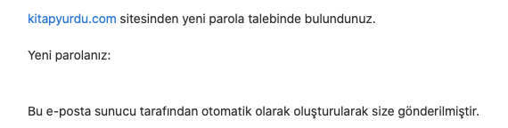
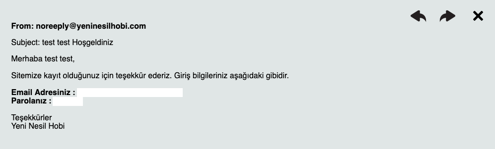

# Companies That Keep Passwords Cleartext

## Pandora.com.tr

The company enforce you to set a password that has lower than 12 character. They also enforce you to use alphanumeric characters but you can use special characters.

After i registered to website, i tried uppercase version of my password and i could successfully log in. So we can see that they keep passwords cleartext.

When i tried to "forgot password" option, they really remind your password. They send your password cleartext as mail.

## Kitapyurdu.com

When i try to reset my password, they sent me a password reset link. So far everything is okay. I thought they don't keep password cleartext.

After i set a new password, they sent my new password as mail.

## Yeninesilhobi.com

When you register to website, they send your password in "welcome" mail. 

